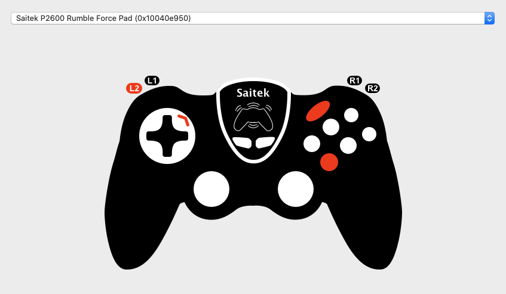

# Saitek Rumble Force Driver

An example userland driver for macOS using IOKit.

## Demo

The main UI will display a list of compatible gamepads plugged into your computer, as well as the state of each button and joystick.

	

Check out [the demo video](media/demo.m4v) for more details.

## Structure

* See `AppDelegate.h` and `AppDelegate.m` for methods related to registering the driver and capturing the USB gamepad,
* See `IOHIDDevice.h` `and IOHIDDevice.m` for input parsing, and `RumbleForceDecodeInfo.h` for device-specific mappings,
* See `ViewController.h`, `ViewController.m` and `Main.storyboard` for UI development.

## Compatibility

This was tested under macOS 10.15 on an Intel mac, using a Saitek Rumble Force P2600.
